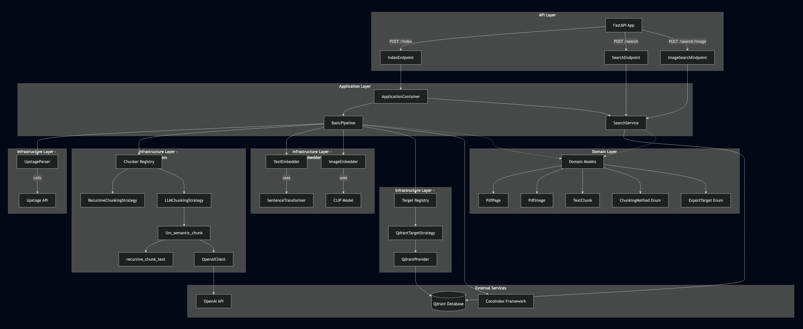

# Document Pipeline
A pipeline project that parses documents and indexes them into a vector database for searchability, featuring flexible incremental updates.

# Layer Architecture 



# Key features
- PDF Document Parsing
- Text Embedding & Chunking
- Image Embedding 
- Vector Search
- Text & Image Hybrid Search

# Supported Extensions
- JPEG, PNG, PDF, DOCX, PPTX, XLSX, HWPX, 

# Supported Chunking Method
- Recursive Chunking
- LLM Semantic Chunking

# Supported Target (VectorDB)
- Qdrant

# Usage

# To-be-Organized

## Postgres & Qdrant 실행
```
docker run -d \
  --name postgres \
  -e POSTGRES_PASSWORD=postgres \
  -e POSTGRES_DB=cocoindex_db \
  -p 5432:5432 \
  postgres

docker run -p 6333:6333 -p 6334:6334 qdrant/qdrant
```

# [temp] how to check state 

## 한 줄로 전체 확인
```bash
echo "=== Postgres ===" && PGPASSWORD=postgres psql -h localhost -U postgres -d cocoindex_db -t -c "SELECT COUNT(*) || ' rows in metadata' FROM cocoindex_setup_metadata;" && echo "=== Chroma ===" && uv run python -c "import chromadb; c = chromadb.PersistentClient('./chroma_db'); print(f'{len(c.list_collections())} collections')" && echo "=== Qdrant ===" && curl -s http://localhost:6333/health || echo "서버 미실행"
```

## postgres 상태 확인

### 테이블 목록
```bash
PGPASSWORD=postgres psql -h localhost -U postgres -d cocoindex_db -c "\dt"
```

### 타겟 정보 확인
```bash
PGPASSWORD=postgres psql -h localhost -U postgres -d cocoindex_db -c "SELECT resource_type, key, state->'state' FROM cocoindex_setup_metadata WHERE resource_type LIKE '%Target%';"
```

### Flow 버전 확인
```bash
PGPASSWORD=postgres psql -h localhost -U postgres -d cocoindex_db -c "SELECT resource_type, state FROM cocoindex_setup_metadata WHERE resource_type = '__FlowVersion';"
```

### 전체 메타데이터 확인
```bash
PGPASSWORD=postgres psql -h localhost -U postgres -d cocoindex_db -c "SELECT * FROM cocoindex_setup_metadata;"
```

## Qdratn 상태 확인
### 컬렉션 목록
```bash
uv run python -c "from qdrant_client import QdrantClient; c = QdrantClient(url='http://localhost:6334', prefer_grpc=True); cols = c.get_collections().collections; print(f'컬렉션: {len(cols)}개'); [print(f'  {col.name}: {c.get_collection(col.name).points_count:,}개') for col in cols]"
```

### 서버 정보
```bash
curl http://localhost:6333/health
```

## Chroma 상태 확인

### 컬렉션 목록 및 문서 수
```bash
uv run python -c "import chromadb; client = chromadb.PersistentClient(path='./chroma_db'); cols = client.list_collections(); print(f'컬렉션: {len(cols)}개'); [print(f'  {c.name}: {c.count():,}개') for c in cols]"
```

### 특정 컬렉션 상세 정보
```bash
uv run python -c "import chromadb; c = chromadb.PersistentClient(path='./chroma_db').get_collection('text_collection'); print(f'문서 수: {c.count()}'); print(f'샘플: {c.peek(limit=1)[\"ids\"][0] if c.count() > 0 else \"없음\"}')"
```